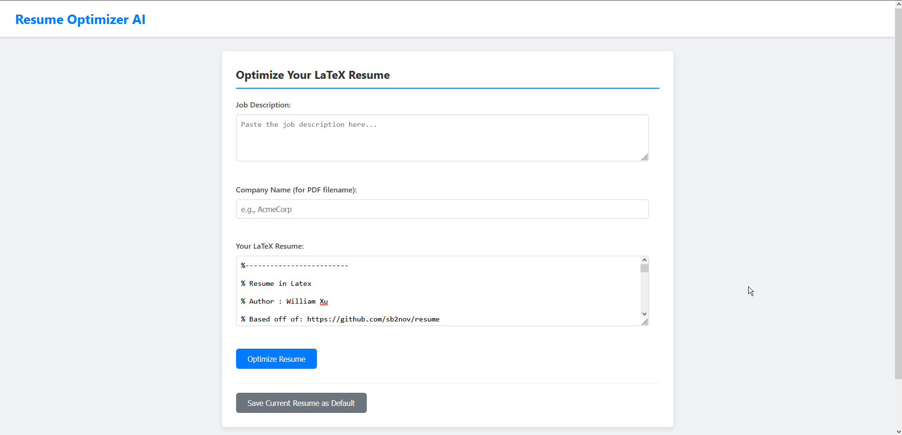

# Resume Optimizer

## Table of Contents
1. [Introduction](#1-introduction)
2. [Setup](#2-setup)
3. [Running the Application](#3-running-the-application)
4. [Features](#4-features)
5. [PDF Generation Prerequisite](#5-pdf-generation-prerequisite)
6. [Application Preview](#6-application-preview)
7. [Project Structure](#7-project-structure)

### 1. Introduction
This project is a Flask web application that optimizes LaTeX resumes based on a job description using OpenAI's GPT-4 model.

### 2. Setup
1. Clone the repository:
    ```bash
    git clone https://github.com/will-iamxu/resumeOptimizer.git
    cd resumeOptimizer
    ```
2. Create a virtual environment and activate it:
    ```bash
    python -m venv venv
    source venv/bin/activate  # On Windows use `venv\Scripts\activate`
    ```
3. Install the required packages:
    ```bash
    pip install -r requirements.txt
    ```
4. Create a `.env` file in the root directory and add your OpenAI API key:
    ```properties
    OPENAI_API_KEY=your_openai_api_key
    ```

### 3. Running the Application
Once the setup is complete, run the Flask application:

**Option 1: Using the Batch Script (Windows)**
1.  Navigate to the project directory (`~\resumeOptimizer`).
2.  Double-click the `run_app.bat` file.
    *   This will attempt to activate a virtual environment named `venv` if it exists in the project root.
    *   It will then start the Flask server and automatically open `http://127.0.0.1:5000/` in your default web browser.
    *   To stop the server, simply close the command prompt window that opens.

**Option 2: Manual Start (All Platforms)**
1.  Open your terminal or command prompt.
2.  Navigate to the project directory:
    ```bash
    cd ~\resumeOptimizer
    ```
3.  If you created a virtual environment, activate it:
    *   Windows: `venv\Scripts\activate`
    *   macOS/Linux: `source venv/bin/activate`
4.  Run the application:
    ```bash
    python app.py
    ```
The application will be accessible at `http://127.0.0.1:5000/` in your web browser. To stop the server, press `CTRL+C` in the terminal.

### 4. Features
*   Optimizes LaTeX resumes based on a job description using OpenAI.
*   Allows saving a default resume to pre-fill the input form.
*   Generates and allows downloading the optimized resume as a PDF (requires LaTeX installation).

### 5. PDF Generation Prerequisite
To use the "Download as PDF" feature, the current setup requires you to have a LaTeX distribution installed on your system, and the `pdflatex` command must be accessible in your system's PATH.

**Installing a LaTeX Distribution:**

*   **Windows: MiKTeX**
    1.  Go to the [MiKTeX download page](https://miktex.org/download).
    2.  Download the installer for Windows.
    3.  Run the installer and follow the on-screen instructions. A standard installation should be sufficient.
    4.  During installation, or afterwards using the MiKTeX Console, ensure that packages are installed automatically "on-the-fly" or pre-install common packages.
    5.  After installation, open a new Command Prompt and type `pdflatex --version` to verify it's correctly installed and in your PATH.

*   **macOS: MacTeX**
    1.  Go to the [MacTeX download page](https://www.tug.org/mactex/downloading.html).
    2.  Download the MacTeX package (`.pkg` file). This is a large download as it includes a comprehensive TeX Live distribution and additional Mac-specific tools.
    3.  Open the downloaded `.pkg` file and follow the installation instructions.
    4.  After installation, open a new Terminal window and type `pdflatex --version` to verify.

*   **Linux: TeX Live**
    1.  Most Linux distributions offer TeX Live through their package managers. This is often the easiest way to install.
        *   **Debian/Ubuntu:**
            ```bash
            sudo apt update
            sudo apt install texlive-full  # This is comprehensive but very large
            # OR for a smaller installation with common packages:
            # sudo apt install texlive-latex-base texlive-latex-recommended texlive-fonts-recommended texlive-latex-extra
            ```
        *   **Fedora:**
            ```bash
            sudo dnf install texlive-scheme-full # Comprehensive
            # OR for a smaller set:
            # sudo dnf install texlive texlive-latex texlive-collection-latexrecommended texlive-collection-fontsrecommended texlive-collection-latexextra
            ```
        *   **Arch Linux:**
            ```bash
            sudo pacman -S texlive-most # For most common packages
            # OR
            # sudo pacman -S texlive-core # For a basic setup
            ```
    2.  Alternatively, you can install TeX Live directly from the [TeX Live website](https://www.tug.org/texlive/acquire-netinstall.html) using their `install-tl` script for the most up-to-date version, but this is a more manual process.
    3.  After installation, open a new Terminal window and type `pdflatex --version` to verify.

**Verification:**
After installation, open a new terminal/command prompt window (it's important to open a *new* one so it picks up any PATH changes) and run:
```bash
pdflatex --version
```
If this command runs successfully and shows version information, your LaTeX distribution is likely set up correctly for the application to use. If the command is not found, you may need to adjust your system's PATH environment variable to include the directory where `pdflatex` was installed, or reinstall ensuring the option to add to PATH is selected.

**Adding LaTeX to your System PATH (if `pdflatex --version` fails):**

The exact directory for `pdflatex` varies depending on your LaTeX distribution and installation choices. Common locations might be:
*   **MiKTeX (Windows):** Often something like `C:\Program Files\MiKTeX 2.9\miktex\bin\x64\` (the version number and `x64` might differ).
*   **MacTeX/TeX Live (macOS/Linux):** Typically `/usr/local/texlive/YYYY/bin/ARCH/` (e.g., `/usr/local/texlive/2023/bin/x86_64-darwin/` or `/usr/local/texlive/2023/bin/x86_64-linux/`). Sometimes it's symlinked to `/usr/local/bin/` or `/opt/local/bin/`.

1.  **Find your LaTeX `bin` directory:** Search your system for `pdflatex` (or `pdflatex.exe` on Windows) to find its location. The directory containing this executable is what you need to add to PATH.

2.  **Windows:**
    *   Search for "environment variables" in the Start Menu and select "Edit the system environment variables".
    *   In the System Properties window, click the "Environment Variables..." button.
    *   Under "System variables" (for all users) or "User variables" (for current user), find the variable named `Path` and select it.
    *   Click "Edit...".
    *   Click "New" and paste the full path to the directory containing `pdflatex.exe`.
    *   Click "OK" on all open windows to save the changes.
    *   Open a *new* Command Prompt and try `pdflatex --version` again.

3.  **macOS & Linux (using Bash or Zsh shell):**
    *   You'll typically edit your shell's configuration file. This is usually `~/.bash_profile`, `~/.bashrc`, `~/.zshrc` (for Zsh, common on newer macOS), or `~/.profile`.
    *   Open the relevant file in a text editor (e.g., `nano ~/.zshrc`).
    *   Add the following line to the end of the file, replacing `/path/to/your/latex/bin` with the actual path you found:
        ```bash
        export PATH="/path/to/your/latex/bin:$PATH"
        ```
    *   Save the file and close the editor.
    *   Either source the file (e.g., `source ~/.zshrc`) or open a *new* Terminal window.
    *   Try `pdflatex --version` again.

    *   **Making it permanent (Linux):** For system-wide changes (less common for user installations), you might create a file in `/etc/profile.d/`.

If you're still having trouble, consult the documentation for your specific LaTeX distribution, as it often includes detailed instructions for PATH setup.

**Alternative: Online LaTeX Compilation Services**
As an alternative to local LaTeX installation, you could integrate an online LaTeX compilation API. This would involve modifying the `download_pdf` function in `app.py` to send the LaTeX code to an external service and receive the PDF back.
*   **Pros:** No local LaTeX installation needed.
*   **Cons:** Dependency on a third-party service, potential costs, data privacy considerations for resume content, and added network latency.

You would need to research and select a suitable API provider if you choose this route.

### 6. Application Preview

Below is a preview of the Resume Optimizer application interface.




### 7. Project Structure
```
resumeOptimizer/
├── app.py                 # Main Flask application
├── run_app.bat            # Batch script to run the application on Windows
├── .env                   # Environment variables (contains API key, gitignored)
├── .gitignore             # Specifies intentionally untracked files that Git should ignore
├── default_resume.tex     # Stores your default resume (gitignored)
├── tmp_latex_files/       # Temporary storage for LaTeX files before PDF conversion (gitignored)
├── assets/                # For static assets like images
│   └── resume.png         # Example application screenshot
├── templates/
│   ├── index.html         # Main page template
│   └── result.html        # Result page template
├── static/                # Static files (CSS, JS, images) - if you add any
├── requirements.txt       # Python dependencies
└── README.md              # This file
```
